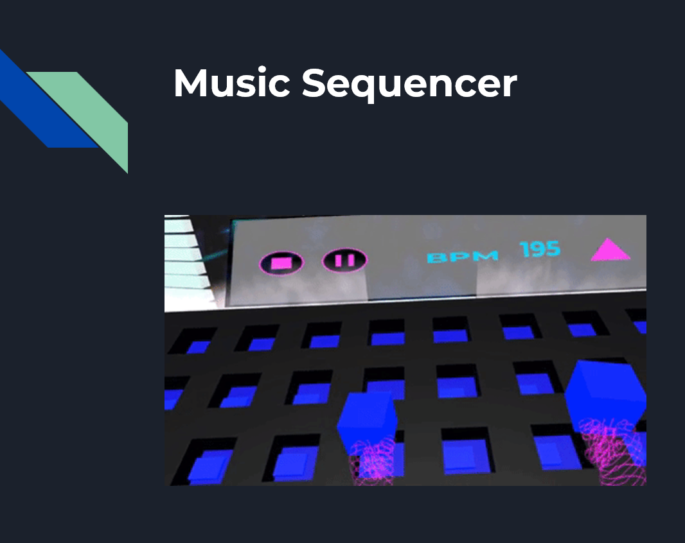
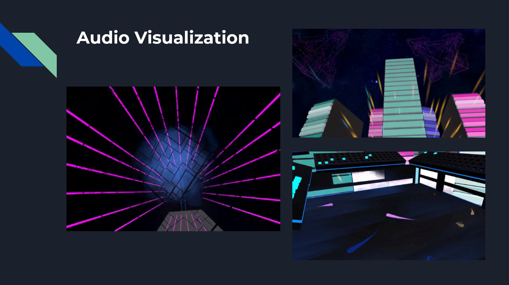
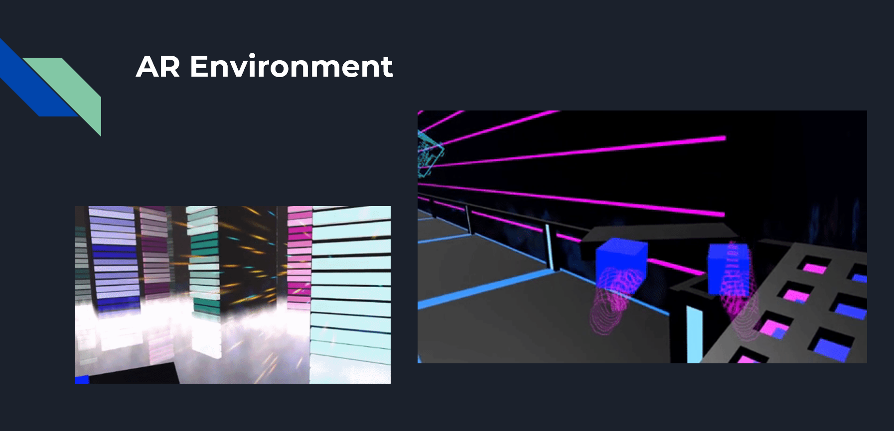

# Sound Escape VR 🎶🚀  

Sound Escape VR is an **immersive virtual reality music-making and exploration experience** that channels a retro 80s synthwave aesthetic while blending **real-time audio visualization** and **interactive world-building**. Originally conceived for Oculus, the project has been **reworked for Meta Quest 3**, ensuring up-to-date performance and **best-in-class VR interactions**. Players craft their own track on a **grid-based sequencer**, then watch the environment **react and transform** in sync with every note they create.

---

## 🚀 Project Overview  

- **Core Concept**: A **hands-on VR music sequencer** that dynamically drives **visual and environmental feedback**.  
- **Key Features**:  
  - **VR Music Creation** with a 16-step sequencer and 80s-themed sound packs.  
  - **FFT-based Real-Time Audio Visualization** featuring **Koch fractals** and neon effects.  
  - **Ambient & Relaxing Exploration** in a colorful, futuristic environment.  
  - **Story-Driven Gameplay**: Create your song to unlock space travel, explore a holographic planet for new sounds, then return to Earth transformed.  
  - **Short, Replayable Sessions** (~15–20 minutes) to experiment with new sound combos and see different visual outcomes.  
- **Modern VR Support**: Optimized for **Meta Quest 3** standards, including **color passthrough** capabilities and refined **hand tracking** options.  

---

## 📌 How It Works  

### 🎛 VR Sequencer & Music Creation  
- **Grid-Based Playback**: Place notes and loops on a **16-step** grid, updated for **Quest 3**’s enhanced controllers and hand tracking.  
- **Realtime Playback**: The system continuously checks for **beat timing** and plays the chosen samples in sync.  
- **Customizable Presets**: Switch between **drums, bass lines, rhythms, leads**, and discover additional samples during exploration.  

### 🌌 Audio-Reactive Visuals  
- **FFT-Driven Animations**: Using Unity’s `GetSpectrumData()` to generate **8 audio bands**, mapping different frequency ranges to fractal scaling, color shifts, and “Koch trails.”  
- **Ambient Environment**: Each note shapes **neon fractals** and holographic geometry, creating an **80s-retro vibe** that evolves with your music.  
- **Refined Performance**: Updated rendering pipeline for Quest 3, ensuring smoother framerate in **real-time fractal visuals**.

---

## 📍 User Flow  

1️⃣ **Office Escape & Setup** (0–3 min)  
   - Narrative intro: You’re a **burned-out software engineer** discovering an ad for “Sound Escape.”  
   - Arrive at a futuristic **spaceport** and interact with an **AI assistant** to **select your initial sound pack**.  

2️⃣ **VR Music Sequencer** (3–8 min)  
   - **Layer drums, bass lines, melodies** on the 16-step grid.  
   - Press **play** to preview your loop. The **environment reacts** visually to each sound you add.  

3️⃣ **Space Travel** (8–10 min)  
   - Board a **spaceship** that displays **wormhole visuals** styled by your track selections (colors and fractals shift based on the chosen sounds).  

4️⃣ **New World Exploration** (10–15 min)  
   - Land on a holographic planet. **Search for new sound elements** hidden in scenic areas or behind simple puzzles.  
   - **Collect** these elements and bring them back to the spaceport to **enhance your track**.  

5️⃣ **Return & Evolution** (15–20 min)  
   - Update the **music sequencer** with newly acquired sounds.  
   - Enjoy an **evolved space travel** sequence back to Earth, now accompanied by your **expanded soundtrack**.  
   - Fade back to reality… or did you?

---

## 🎮 Features & Technical Stack  

| Feature                        | Tech Used                                                |
|--------------------------------|----------------------------------------------------------|
| **VR Interaction**             | Unity XR Toolkit + **Meta Quest 3** SDK                  |
| **Music Sequencer**            | Custom C# scripts, **SampleManager** + AudioSource arrays|
| **Audio Visualization**        | FFT-based data analysis (`GetSpectrumData()`)            |
| **Fractal Effects**            | Custom shader logic for **Koch lines** and neon trails   |
| **Story & Exploration**        | Narrative scripting + Interactive VR environments        |
| **Retro Sound Design**         | FL Studio for 80s-style presets (Harmless, Sytrus, Harmor)|

---

## 📸 Screenshots & Visuals  

### 🎼 VR Music Interface  
A **16-step grid** for layering drum loops, bass lines, and synth leads in a **futuristic** environment.

  

### 🌌 Audio-Reacting Fractals  
**Koch lines** and **glowing fractals** scale with amplitude and frequency.  

  

### 🚀 Space Travel & Exploration  
Your **chosen track** drives the **wormhole’s color palette** and swirling patterns.  

  

---

## 📌 Project Status  

- ✅ **Core Sequencer** functional with 80s-style sample packs.  
- ✅ **FFT-Based Visualization**: Working fractal logic and dynamic environment.  
- ✅ **Quest 3 Optimization**: Updated rendering + performance tweaks.  
- 🚧 **Exploration & AI**: Further refining puzzle mechanics and planetary expansions.  
- 🚧 **Accessibility**: Experimenting with **hand tracking** and **voice commands** to reduce controller reliance.

---

## 👥 Team & Roles  

- **Michael Chaves** – *Creator, Lead Developer (Sequencer & Visualization), 3D Modeler, Audio Designer*  

---

## 🎬 Demo & Development  

- **Prototype Builds**: Currently private but updated **demo videos** are being tested internally.  
- **Unity Project**: Built with **Unity 202x** + **Meta XR** Integration.  

### 📌 Requirements  
- **Meta Quest 3** + Controllers or **hand tracking**  
- **Unity** (if contributing code)  
- **VR-Ready PC** (for development builds and asset creation)  

---

## 💡 Future Plans  

- **Puzzle Elements**: Unlocking new sound packs or fractal effects in the holographic world.  
- **Multiplayer Jam Sessions**: Collaborate in real time with other players.  
- **Expanded Fractal Library**: Beyond Koch lines—explore Sierpinski carpets, Menger cubes, etc.  
- **Voice Interaction**: Hands-free approach for adding/removing loops by voice command.  

---

## 📜 License  

**License: Currently under review and not publicly disclosed.**  
*All rights reserved. Contact the project team to discuss usage or collaborations.*  

---

## 📢 Contact & Feedback  

Questions, contributions, or feedback?  
- **Issues & Requests**: [GitHub Issues](https://github.com/mikechaves/sound-escape-vr/issues)  
- **Email**: mike@digitalhous.com  

> **Immerse yourself in retro synth vibes, harness next-gen VR technology, and let your music reshape reality.**  
> **Create, explore, and discover new worlds through Sound Escape VR on Quest 3!**  